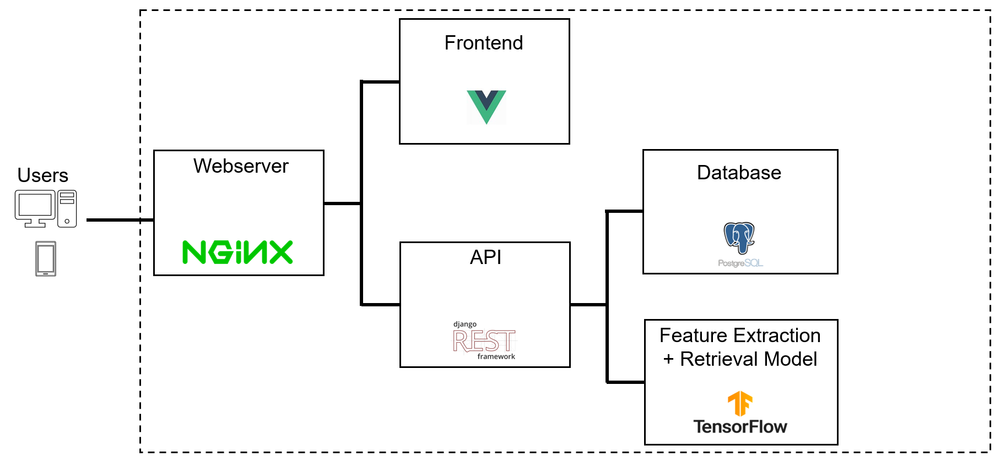
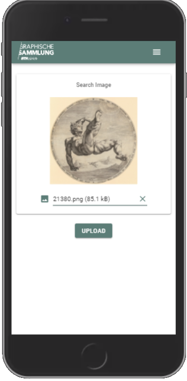

#  Reverse Image Search for Graphical Collections 
_- in development_ -


Image Retrieval / Reverse Image Search Application for finding digitised print metadata. Made to support workflows at graphical collections and museums.  

The application is hosted online at https://imagesearch.ellprototypes.ch where you can upload your own pictures to find visually similar prints from a database of over 20,0000 prints from the Graphische Sammlung of ETH Zürich.  


## Offline Use

It is also possible to clone the project to run locally on your own computer. This will require some basic experience with using git and the command line but allows you to perform image retrieval queries (reverse image searches) with your own data.  

1. open a terminal in a directory where you want to save the project to
```shell
git clone https://github.com/eth-library-lab/open-image-search.git
cd open-image-search
```
2. copy the images that you want to add to the database into this folder

_search-model/data/raw/default/images_  

alternatively

3. (optional) if there are some images that you want to filter out of the dataset (e.g. placeholder images etc.). Copy the image to the 

_search-model/data/raw/default/images_to_remove_

4. (optional) Metadata for the images can be specified by copying a csv file to the folder:  _search-model/data/raw/default/metadata_. Only certain column names are allowed so refer to the metadata section for details.

5. Create a virtual environment and install the software dependencies. 
```
python3 -m venv ./venv
source ./venv/bin/activate
pip install -r requirements.txt
```

6. If the packages have installed correctly then program will be ready to run. 

```
cd src
python3 run.py
```

## Current Architecture

### Libraries/Frameworks

* Tensorflow
* Scikit-Learn
* Vue
* Django
* Sqlite3
* Nginx

The application is currently in a prototype phase with the following simplified architecture. Each service runs in a docker container.



<br/><br/>      

## Data Processing, Model Training & Evaluation


Data processing & model training can be run end to end via python scripts (optionally in a container) or selectively run using individual jupyter notebooks. 

### Folder Structure for Data

inside of the search-model module data is taken from raw input to processed outputs. The folder structure convention follows the [cookiecutter datascience](https://drivendata.github.io/cookiecutter-data-science/) format.  
Raw input data is considered immutable and is saved in  
**data/raw** 
Final cleaned, processed and calculated data is saved in  
**data/processed**  

Inside each of these folders, data is grouped by **dataset_name**. This is typically the name of the institution, collection or archive that provides the data.
Inside the institution's folder metadata and images are stored in seperate folders  
 folder paths would look like:  
data/raw/ethz/images
data/raw/ethz/metadata

```
├── data
    ├── interim
    ├── processed
    └── raw
        └── test_set
            ├── images
            │   ├── 11.png
            │   ├── 18.png
            │   ├── 19.png
            │   └── 33.png
            │       
            ├── metadata
            │   └── metadata_example.csv
            │ 
            └── images_to_remove
                └── 11.png

```

### Feature Extraction
Each image in our records is passed to a CNN, VGG16, and the features calculated in the final convoluational black are flattened, max pooled, and stored in the database. These act like a 'fingerprint' for each image which can be compared to the inpute query image.

```
_________________________________________________________________
Layer (type)                 Output Shape              Param #   
=================================================================
input_1 (InputLayer)         [(None, 224, 224, 3)]     0         
_________________________________________________________________
VGG16 until layer:
block5_pool (MaxPooling2D)   (None, 7, 7, 512)         0         
_________________________________________________________________
max_pooling2d (MaxPooling2D) (None, 1, 1, 512)         0         
_________________________________________________________________
flatten (Flatten)            (None, 512)               0         
_________________________________________________________________
layer_normalization          (None, 512)               1024      
=================================================================
Total params: 14,715,712
Trainable params: 14,715,712
Non-trainable params: 0
_________________________________________________________________
```

### Search Model Training
The stored features are used to train a k-nearest neighbours model (KNN). (Currently a Sci-kit learn model but this will be replaced with Tensorflow's SCANN or Spotify's ANNOY in the future as the number of records grows.) 

_more details to follow_


## Frontend 
The frontend is a web app made with Vue with the Vuex & Vuetify plugins. The interface is designed for the layouts and components to work just as well on mobile devices. This allows for search requests to be sent directly from the phone's camera. 



## Backend

The backend consists of an API built with Django REST Framework. 
Uploaded images are reformatted in memory and a request is sent to the feature extraction model.
The features returned by the model are then passed to the KNN model.  
The KNN model contains the id's from the database to allow remapping in memory. These ids are used to query the Database to return the metadata for the top results.

# Project Vision
The vision is to include more images from collections around Europe to enable better sharing of resources.

## Contact

For any inquiries, use the ETH Library Lab [contact form](https://www.librarylab.ethz.ch/contact/).

## License

[MIT](LICENSE)
