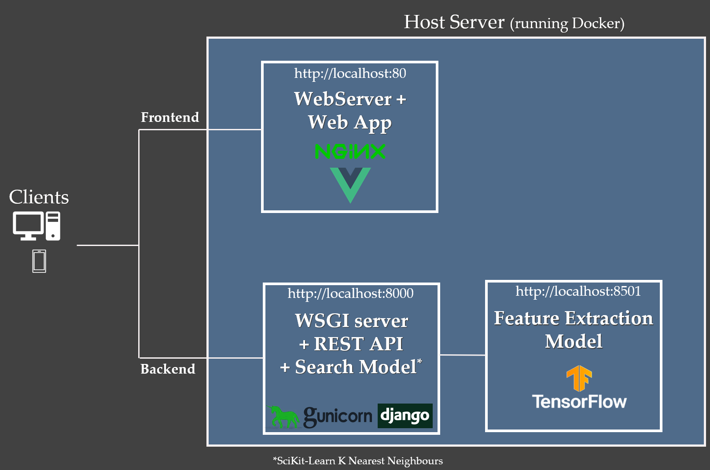

#  Reverse Image Search for Graphical Collections 
_- in development_ -

Image Retrieval / Reverse Image Seach Application for finding digitised print metadata. Made to support workflows at graphical collections and museums.  

The codebase and application will be publicly available Spring 2021. If you are interested in earlier access, we would love to hear from you. Please get in touch via the ETH Library Lab [contact form](https://www.librarylab.ethz.ch/contact/).


## Current Architecture

### Libraries/Frameworks

* Tensorflow
* Scikit-Learn
* Vue
* Django
* Sqlite3
* Nginx

The application is currently in a prototype phase with the following simplified architecture. Each service runs in a docker container.



<br/><br/>      

## Data Processing, Model Training & Evaluation

Data processing & model training can be run end to end via python scripts (optionally in a container) or selectively run using individual jupyter notebooks. 

_more details to follow_

### Feature Extraction
Each image in our records is passed to a CNN, VGG16, and the features calculated in the final convoluational black are flattened, max pooled, and stored in the database. These act like a 'fingerprint' for each image which can be compared to the inpute query image.

```
_________________________________________________________________
Layer (type)                 Output Shape              Param #   
=================================================================
input_1 (InputLayer)         [(None, 224, 224, 3)]     0         
_________________________________________________________________
VGG16 until layer:
block5_pool (MaxPooling2D)   (None, 7, 7, 512)         0         
_________________________________________________________________
max_pooling2d (MaxPooling2D) (None, 1, 1, 512)         0         
_________________________________________________________________
flatten (Flatten)            (None, 512)               0         
_________________________________________________________________
layer_normalization          (None, 512)               1024      
=================================================================
Total params: 14,715,712
Trainable params: 14,715,712
Non-trainable params: 0
_________________________________________________________________
```

### Search Model Training
The stored features are used to train a k-nearest neighbours model (KNN). (Currently a Sci-kit learn model but this will be replaced with Tensorflow's SCANN or Spotify's ANNOY in the future as the number of records grows.) 

_more details to follow_


## Frontend 
The frontend is a web app made with Vue with the Vuex & Vuetify plugins. The interface is designed for the layouts and components to work just as well on mobile devices. This allows for search requests to be sent directly from the phone's camera. 


## Backend

The backend consists of an API built with Django REST Framework. 
Uploaded images are reformatted in memory and a request is sent to the feature extraction model.
The features returned by the model are then passed to the KNN model.  
The KNN model contains the id's from the database to allow remapping in memory. These ids are used to query the Database to return the metadata for the top results.

# Project Vision
The vision is to include more images from collections around Europe to enable better sharing of resources.

## Contact

For any inquiries, use the ETH Library Lab [contact form](https://www.librarylab.ethz.ch/contact/).

## License

[MIT](LICENSE)