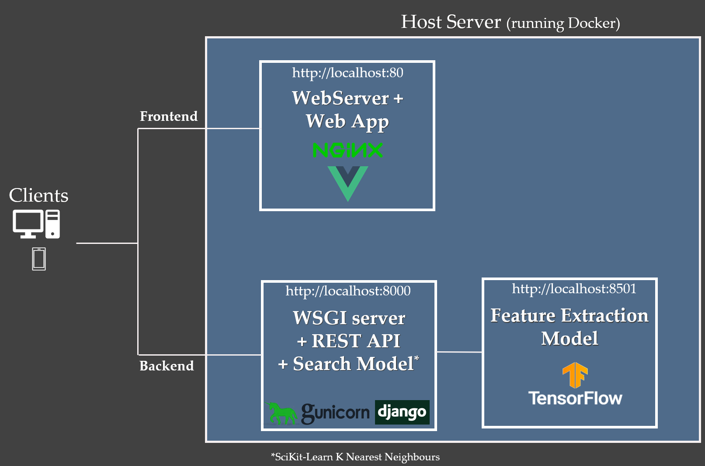

# graph-samm
#### _Under Development_

Prototype reverse image-search app for finding digitized prints and paintings; made to support workflows at graphical collections.

# start up

docker-compose up

# Current Architecture

**Libraries/Frameworks** 

* Scikit-Learn
* Tensorflow
* Django
* Sqlite3
* Vue
* Nginx

The application is currently in a prototype phase with the following simplified architecture.  
Each service runs in a docker container.

## Data Processing, Model Training & Evaluation

Data processing & modelling is currently done in a set of sequential Jupyter Notebooks.
As the project develops these notebooks will be converted into python scripts to enable better automation & testing.

#### Image Preprocessing

#### Feature Extraction

#### Search Model Training

#### Search Model Evaluation

## Frontend 
The frontend is a web app made with Vue with the Vuex & Vuetify plugins.
Care is taken for the layout and components to work well also on mobile devices. 

## Backend

The backend consists of a simple API built with Django REST Framework. 
Uploaded images are reformatted in memory and a request is sent to the feature extraction model.
The features returned by the model are then passed to the KNN model.
The KNN model contains the id's from the database to allow remapping in memory.
These ids are used to query the Sqlite db to return the metadata for the top results.

# Project Vision
The vision is to include more images from collections around Europe to enable better sharing of resources.

## Contact

For any inquiries, use the ETH Library Lab [contact form](https://www.librarylab.ethz.ch/contact/).

## License

[MIT](LICENSE)
